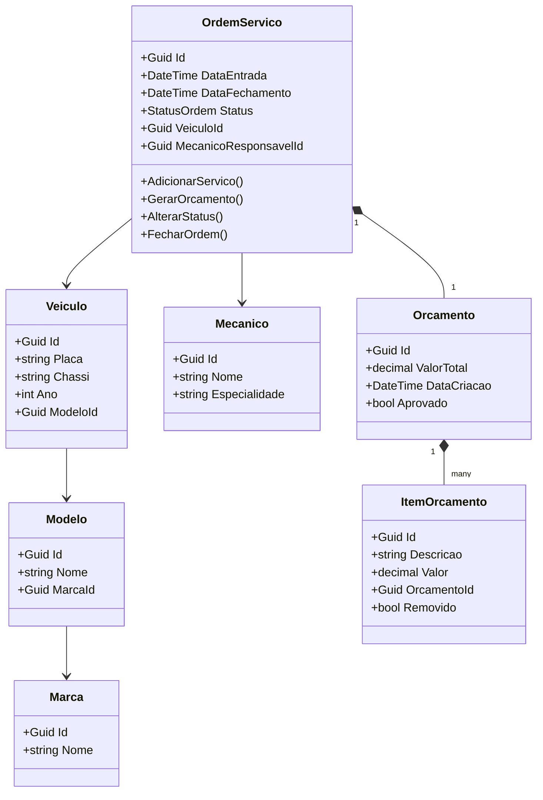

Projeto visa ser uma aplicação que gerencia serviços em uma oficina mecânica com cadastro de funcionários, entrada e saída de veículos e serviços.

Abaixo  o diagrama pensado para o sistema:

```mermaid
classDiagram

%% ======================
%% ENTIDADES PRINCIPAIS
%% ======================

class Veiculo {
  +Guid Id
  +string Placa
  +string Chassi
  +int Ano
  +Guid ModeloId
}

class Modelo {
  +Guid Id
  +string Nome
  +Guid MarcaId
}

class Marca {
  +Guid Id
  +string Nome
}

class Mecanico {
  +Guid Id
  +string Nome
  +string Especialidade
}

class OrdemServico {
  +Guid Id
  +DateTime DataEntrada
  +DateTime DataFechamento
  +StatusOrdem Status
  +Guid VeiculoId
  +Guid MecanicoResponsavelId
  
  +AdicionarServico()
  +GerarOrcamento()
  +AlterarStatus()
  +FecharOrdem()
}

class Orcamento {
  +Guid Id
  +decimal ValorTotal
  +DateTime DataCriacao
  +bool Aprovado
}

class ItemOrcamento {
  +Guid Id
  +string Descricao
  +decimal Valor
  +Guid OrcamentoId
  +bool Removido
}

Veiculo --> Modelo
Modelo --> Marca

OrdemServico --> Veiculo
OrdemServico --> Mecanico
OrdemServico "1" *-- "1" Orcamento
Orcamento "1" *-- "many" ItemOrcamento
```